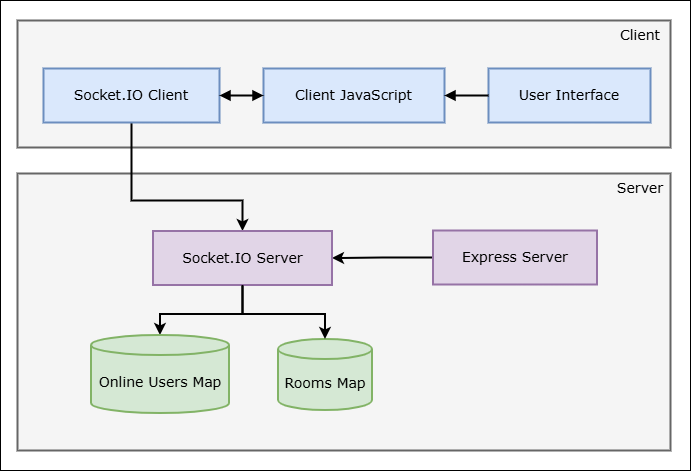
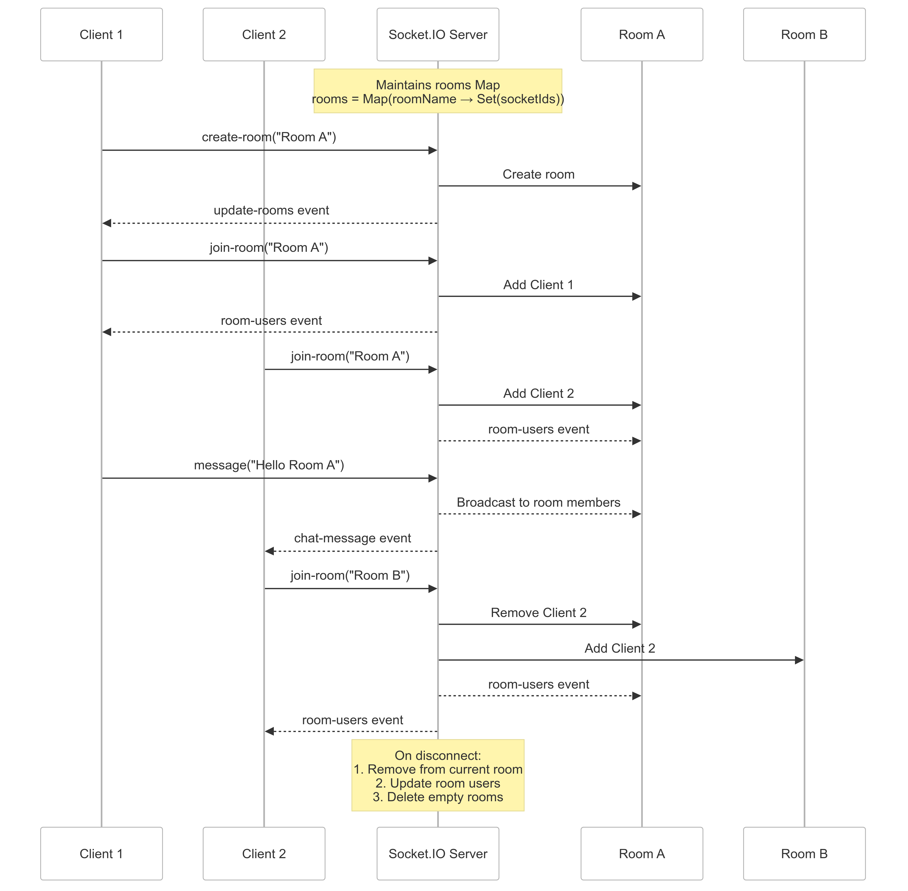

# Chat App with Socket.io

In this lab, we will build a chat app using Socket.io extending our previous lab by integrating rooms.



## key features

- A user can create a room
- A user can join a room, and leave a room
- A user can send messages and receive messages from a room
- A user can see the list of rooms
- A user can see the list of online users in a room

## What is Room?

A room is a group of users that can send messages to each other. A user can join a room, and leave a room. A user can send messages and receive messages from a room. A user can see the list of rooms. A user can see the list of online users in a room.



### Project Structure

We will create a project named `Chat App` and add the necessary files to it.

```
Chat App
├── package.json
├── server
│   ├── server.js
├── public/
│   ├── index.html
│   ├── style.css
│   └── js
│       └── script.js
└── README.md
```

### **Setting Up the Server**

**1. Project initialization and Dependencies**

First we will initialize a new Node.js project and install the necessary dependencies. Run the following commands in your terminal:

```bash
npm init -y
npm install --save express socket.io
```

We will need to install `nodemon` to automatically restart the server when we make changes to the code. Run the following command in your terminal:

```bash
npm install --save-dev nodemon
```

> `--save-dev` is used to install the dependencies in the devDependencies section of the package.json file.

Update the `scripts` section of the `package.json` file to include the following:

```json
"scripts": {
    "start": "node server/server.js",
    "dev": "nodemon server/server.js"
}
```

**2. Chat app UI**

We will create a simple UI for the chat application. Create a file named `index.html` in the `public` folder and add the following code to it:

```html
<!DOCTYPE html>
<html lang="en">
<head>
    <meta charset="UTF-8">
    <meta name="viewport" content="width=device-width, initial-scale=1.0">
    <title>Chat App</title>
    <link rel="stylesheet" href="style.css">
    <script src="/socket.io/socket.io.js"></script> <!-- Socket.io client library -->
</head>
<body>
    <div class="chat-container">
        <!-- Header Section -->
        <div class="header">
            <h3 id="online-users">Online Users:</h3>
        </div>

        <!-- Chat Messages Display -->
        <div id="chat-box" class="chat-box">
            <!-- Messages will be dynamically added here -->
        </div>

        <!-- Input Box -->
        <div class="input-container">
            <input id="message-input" type="text" placeholder="Type a message..." autocomplete="off">
            <button id="send-button">Send</button>
        </div>
    </div>

    <script src="js/index.js"></script>
</body>
</html>
```

- `<script src="/socket.io/socket.io.js"></script>` is used to include the Socket.io client library in the HTML file. This is required for the client to connect to the server.

- `<link rel="stylesheet" href="style.css">` is used to include the CSS file in the HTML file. This is required for the UI to be styled properly.

- `<script src="js/index.js"></script>` is used to include the JavaScript file in the HTML file. This is required for the client to connect to the server.

Now Create a file named `style.css` in the `public` folder and add the following code to it:

```css
body {
    font-family: Arial, sans-serif;
    background-color: #f0f2f5;
    display: flex;
    justify-content: center;
    align-items: center;
    height: 100vh;
    margin: 0;
}

.header {
    background-color: #006edc;
    color: white;
    padding: 10px;
    border-radius: 15px 15px 0 0;
    font-size: 16px;
    text-align: center;
}

.chat-container {
    width: 50%;
    height: 80vh;
    display: flex;
    flex-direction: column;
    background: white;
    border-radius: 15px;
    box-shadow: 0 4px 10px rgba(0, 0, 0, 0.2);
    overflow: hidden;
    padding: 10px;
}

#chat-box {
    flex-grow: 1;
    overflow-y: auto;
    padding: 10px;
    display: flex;
    flex-direction: column;
}

/* Message container */
.message-container {
    display: flex;
    flex-direction: column;
    margin-bottom: 12px;
    max-width: 75%;
    padding: 5px;
}

/* Sent message (blue bubble) */
.sent {
    align-self: flex-end;
    text-align: right;
}

.sent .message-bubble {
    background-color: #0084ff;
    color: white;
    border-radius: 18px 18px 0 18px;
    padding: 10px 15px;
    font-size: 14px;
    max-width: 100%;
    word-wrap: break-word;
}

/* Received message (gray bubble) */
.received {
    align-self: flex-start;
}

.received .message-bubble {
    background-color: #e4e6eb;
    color: black;
    border-radius: 18px 18px 18px 0;
    padding: 10px 15px;
    font-size: 14px;
    max-width: 100%;
    word-wrap: break-word;
}

/* Sender name & timestamp */
.message-info {
    font-size: 12px;
    color: gray;
    margin-bottom: 2px;
}

.sender-name {
    font-weight: bold;
}

.message-time {
    font-size: 10px;
    color: #888;
    margin-top: 3px;
    display: block;
}

/* Input area */
.input-container {
    display: flex;
    padding: 10px;
    background: white;
    border-top: 1px solid #ddd;
}

#message-input {
    flex-grow: 1;
    padding: 10px;
    border: 1px solid #ddd;
    border-radius: 20px;
    outline: none;
    font-size: 14px;
}

#send-button {
    background-color: #0084ff;
    color: white;
    border: none;
    padding: 8px 15px;
    border-radius: 20px;
    margin-left: 10px;
    cursor: pointer;
    font-size: 14px;
    transition: 0.2s;
}

#send-button:hover {
    background-color: #006edc;
}
```

**3. Server Setup**

Now we will create a server file and add the necessary code to it. Create a file named `server.js` in the root of your project and add the following code to it:

```js
const express = require('express');
const app = express();
const path = require('path');
const port = process.env.PORT || 3000;

app.use(express.static(path.join(__dirname, '../public')));

const server = app.listen(port, () => {
    console.log(`Server is up on port ${port}`);
});

const io = require('socket.io')(server);

let onlineUsers = new Map();

io.on('connection', (socket) => {
    console.log('A new user connected: ', socket.id);

    socket.on('set-name', (name) => {
        onlineUsers.set(socket.id, name);
        io.emit('onlineUsers', onlineUsers.size);
    });

    socket.on('disconnect', () => {
        onlineUsers.delete(socket.id);
        io.emit('onlineUsers', onlineUsers.size);
    });

    socket.on('message', (message) => {
        socket.broadcast.emit('chat-message', message);
    });
});
```

**4. Client Setup**

Now we will create a client file and add the necessary code to it. Create a file named `index.js` in the `public/js` folder and add the following code to it:

```js
const socket = io();

let userName = prompt("Enter your name:") || "Anonymous"; // Ask user for name
socket.emit('set-name', userName); // Send to server

const chatBox = document.getElementById('chat-box');
const messageInput = document.getElementById('message-input');
const sendButton = document.getElementById('send-button');

socket.on('onlineUsers', (count) => {
    document.getElementById('online-users').textContent = `Online Users: ${count}`;
});

sendButton.addEventListener('click', (e) => {
    e.preventDefault();
    sendMessage();
});

messageInput.addEventListener('keypress', (e) => {
    if (e.key === 'Enter') {
        sendMessage();
    }
});

function sendMessage() {

    if (messageInput.value.trim() === '') {
        return;
    }

    const message = {
        text: messageInput.value,
        sender: userName, // Send username
        timestamp: new Date().toLocaleTimeString([], { hour: '2-digit', minute: '2-digit' })
    };
    socket.emit('message', message);
    addMessageToChat(message, true);
    messageInput.value = '';
}

function addMessageToChat(message, isSender) {
    const messageContainer = document.createElement('div');
    messageContainer.classList.add('message-container', isSender ? 'sent' : 'received');

    messageContainer.innerHTML = `
        <div class="message-info">
            <span class="sender-name">${message.sender}</span>
            <span class="message-time">${message.timestamp}</span>
        </div>
        <div class="message-bubble">${message.text}</div>
    `;

    chatBox.appendChild(messageContainer);
    chatBox.scrollTop = chatBox.scrollHeight;
}

// Receive message from server
socket.on('chat-message', (message) => {
    addMessageToChat(message, false);
});
```

**5. Running the Server**

To run the server, we will use the following command in our terminal:

```bash
npm run dev
```

