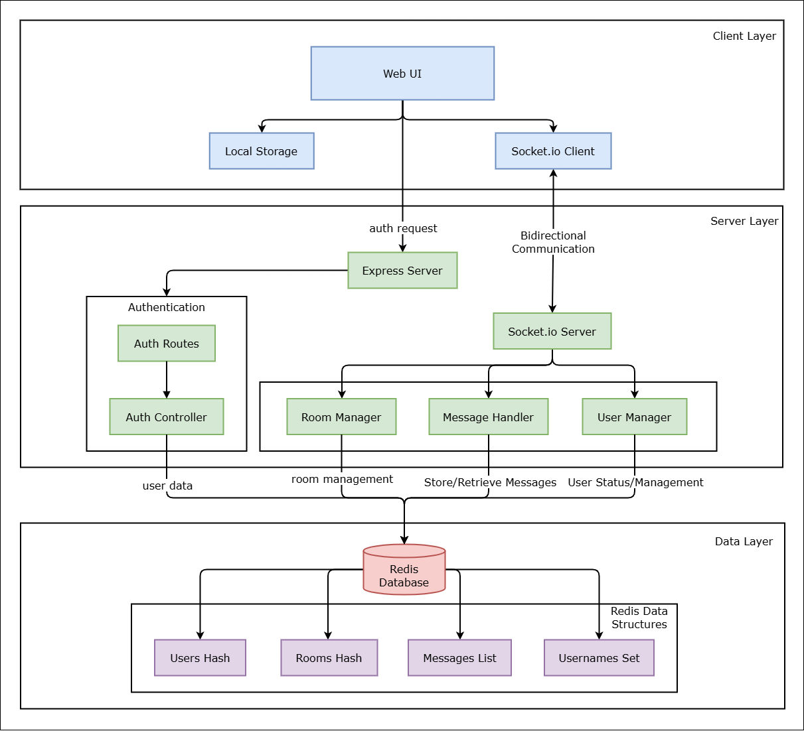
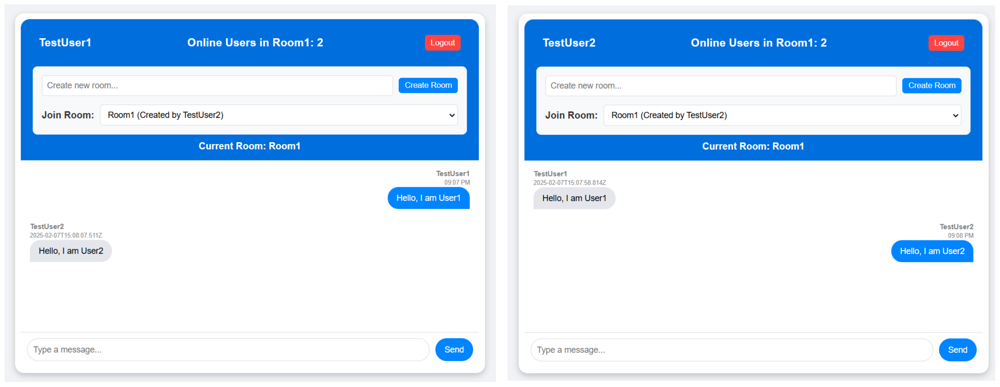

# Scalable Chat Application

This is a scalable chat application built with Node.js, Express, and Socket.io. It allows users to chat with each other in real-time. We have also used Redis adapter for consistent data across multiple instances of the application.

## Prerequisites

- Node.js
- Redis
- Docker

## How to run the application

1. Clone the repository
2. Run `npm install`
3. Run `docker-compose up --build`

Access the application at `http://localhost:8080`

