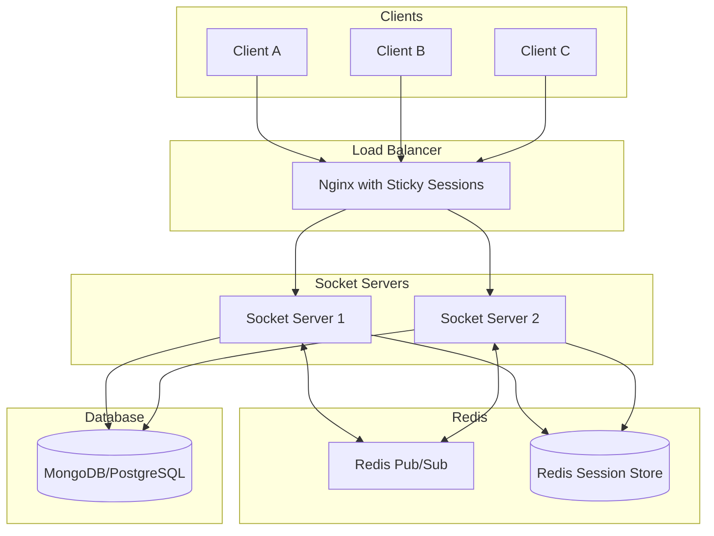

Now i want to scale this chat application to multiple servers using Redis Pub/Sub.

Key Components:

1. Load Balancer
- Nginx with sticky sessions (essential for WebSocket connections)
- SSL termination
- WebSocket protocol support

3. Redis Layer
- Pub/Sub for cross-server message broadcasting
- Session store for user-socket mapping
- Temporary data caching

This design handles two critical scenarios:
1. User connections are distributed across multiple socket servers.
2. When a server goes down and connections are redistributed.

Here is the architecture diagram:

